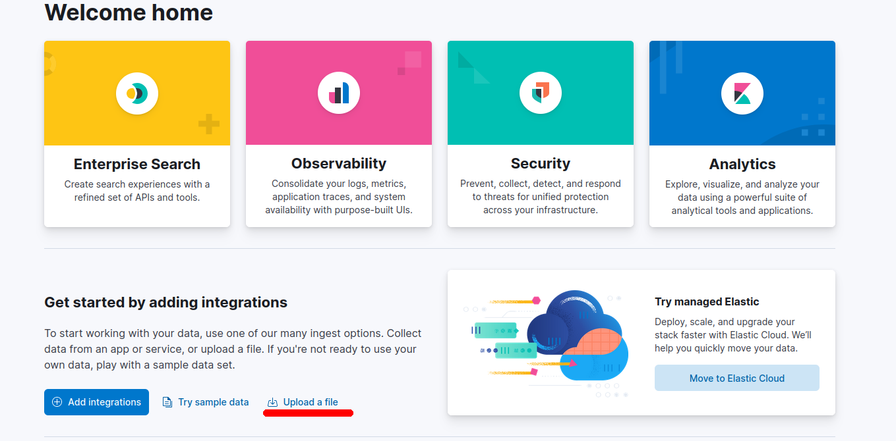
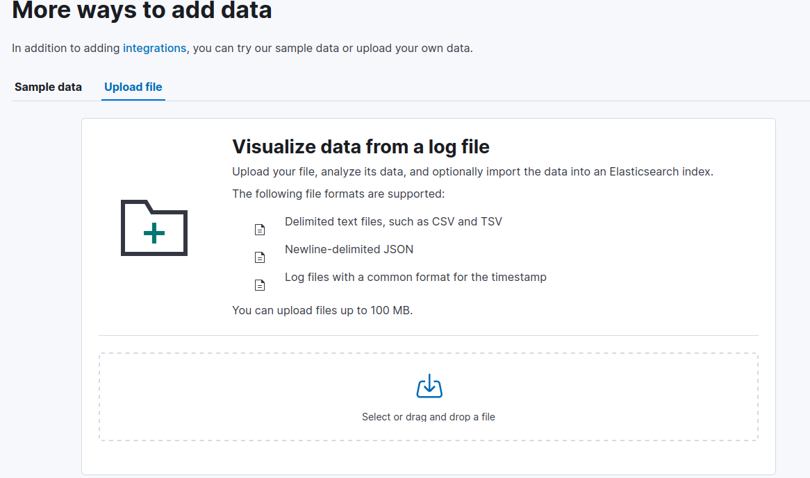
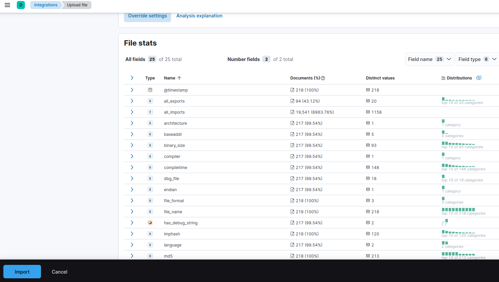
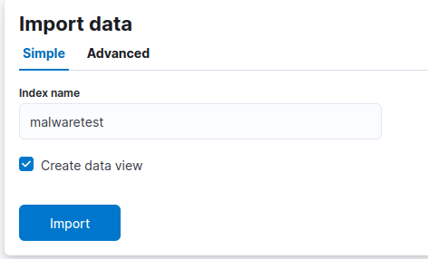
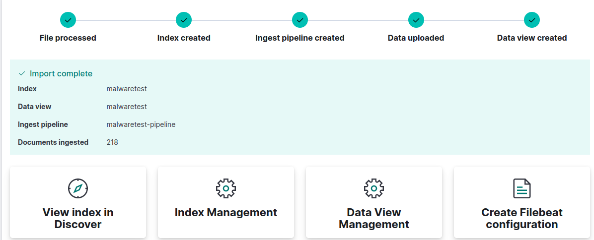
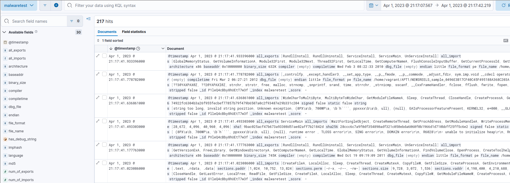

## Data Extraction & Labeling
With malware downloaded, now we'll want to start parsing our data to ingest into Elasticsearch to start identifying trends, hunting for related samples, etc... This is a great opportunity to start thinking about building **your own** tools to learn about parsing different file formats. 
For the sake of time, we'll use [r2elk](https://www.github.com/archcloudlabs/r2elk), but considering coming back to this portion after the workshop and exploring more data extraction opportunities.

R2ELK is utility made by Arch Cloud Labs to leverage radare2 for metadata extraction. This includes:
* File name
* File format
* MD5 hash
* SHA1 hash
* SSDeep Hash
* ImpHash: Import hash calculation.
* Architecture: Architecture the binary is compiled for.
* Binary size: Size of the binary
* Programming language Used (identified by r2)
* Compiler info: Compile name and version used.
* Compiled time: When was the binary compiled.
* Stripped: Does the binary have debug symbols.
* Static: Is the binary dynamically or statically linked.
* Signed: is the binary cryptographically signed or not.
* Strings: The first 100 strings within a binary.
* PDB file paths: The PDB file path (Windows only).
* Base address: The base address the binary is loaded at.
* Imports: Additional libraries that are imported.
* Exports: Functions that are exported.
* Yara Rule matching (Optional).

Gathering all of this data into a central database (Elasticsearch) allows us, as researchers to start grouping together trends for daily downloads. These trends of samples can then be used to identify what makes for good blog posts, interesting research, and a great way to start reversing different kinds of malware.

### Manual Installation

The initial Ansible script in [00_Setup](../00_Setup/README.md) should have already downloaded a repo called "r2elk" in Vagrant's home folder.
If not, you can go forth and install manually via the following commands:

``` sh
git clone https://github.com/archcloudlabs/r2elk;
cd r2elk;
python3 -m pip3 install -r requirements.txt;
sudo apt install yara libfuzzy-dev libyara-dev jq;
```

## APT1 Malware Samples
In order to ensure we all have the same samples, we'll be looking at the APT-1 malware data set.
This data set is available through multiple online providers, but its nicely curated on No Starch Press' Malware Data Science book's companion website [here](https://drive.google.com/open?id=11kvnSB9yQLaIdRI47z0PNjAyhXH6h0UK). 

After downloading the zip file, copy it into the Vagrant virtual machine via the ```scp``` utility or via Vagrant's upload sub-command.
The example below shows how to copy the file, but you'll have to change the IP address to your Vagrant IP.
```
$> scp malware_data_science_entrypoints_redacted.zip vagrant@192.168.124.66:
```
or 

```
$> vagrant upload malware_data_science_entrypoints_redacted.zip
```

Next, **within the Vagrant machine**, we'll unzip the file.

``` sh
vagrant@hackspacecon:~$ unzip malware_data_science_entrypoints_redacted.zip 
```

Chapter 4 contains the malware sample's we'll be looking at.

The path is: ```/home/vagrant/malware_data_science/ch4/data/APT1_MALWARE_FAMILIES```
Change your working directory to this path.

```
cd /home/vagrant/malware_data_science/ch4/data/APT1_MALWARE_FAMILIES;
```

Then, we'll create a new directory in our home folder for JUST the malware samples.

``` sh
mkdir ~/apt1;
```

Finally, we'll copy all of the binaries from the ```APT1_MALWARE_FAMILES``` sub-folders to ```~/apt1``` to make it easy for ```r2elk``` to run against.

``` sh
vagrant@hackspacecon:~/malware_data_science/ch4/data/APT1_MALWARE_FAMILIES$ find . -type f -print0 | xargs -0 grep -rail 'dos mode' | xargs -I {}  cp -u {} ~/apt1
```

At this point you should have a directory called "apt1" in the home folder of the vagrant machine with APT1 samples.
An example of said output is shown below.

``` sh
vagrant@hackspacecon:~/apt1$ pwd
/home/vagrant/apt1
vagrant@hackspacecon:~/apt1$ ls -l 
total 19444
-rwxr-x--- 1 vagrant vagrant   7168 Apr  9 13:28 1F2EB7B090018D975E6D9B40868C94CA
-rwxr-x--- 1 vagrant vagrant   8192 Apr  9 13:28 33DE5067A433A6EC5C328067DC18EC37
-rwxr-x--- 1 vagrant vagrant  46592 Apr  9 13:28 36CD49AD631E99125A3BB2786E405CEA
-rwxr-x--- 1 vagrant vagrant   8192 Apr  9 13:28 65018CD542145A3792BA09985734C12A
-rwxr-x--- 1 vagrant vagrant   8192 Apr  9 13:28 650A6FCA433EE243391E4B4C11F09438
-rwxr-x--- 1 vagrant vagrant   8192 Apr  9 13:28 6FAA4740F99408D4D2DDDD0B09BBDEFD
-rwxr-x--- 1 vagrant vagrant   8192 Apr  9 13:28 785003A405BC7A4EBCBB21DDB757BF3F
-rwxr-x--- 1 vagrant vagrant   7168 Apr  9 13:28 8442AE37B91F279A9F06DE4C60B286A3
-rwxr-x--- 1 vagrant vagrant   8192 Apr  9 13:28 99A39866A657A10949FCB6D634BB30D5
```

*Note: I've contacted an author of Malware Data Science for permission to reference their book's samples here*

## Yara & R2ELK
**If we're running low on time, apt1.json in this folder can be used to skip this step**

The r2elk repo uses the yara-rules repository as a git [submodule](https://git-scm.com/book/en/v2/Git-Tools-Submodules) to be able to easily point at a set of rules to use for labeling purposes. First, we need to create the ".yar" file that we'll use for generating this. From the ```r2elk``` directory execute ```./rules/index_gen.sh```to generate a single ```index.yar``` file. 

The Ansible script should have completed this for you, but if not you can execute the ```index_gen.sh```command below manually.
The output on your console should be similar to the output below.

``` sh
vagrant@hackspacecon:~/r2elk$ pwd
/home/vagrant/r2elk
vagrant@hackspacecon:~/r2elk$ ./rules/index_gen.sh
   **************************
          Yara-Rules
        Index generator
   **************************
[+] Generating rules index...
[+] Generating index_w_mobile...
[+] Generating index...
```

Now, we'll point r2elk to a directory of malware (```-d```) in addition to specifying the ```index.yar``` file for yara scanning and then redirect said output to malware.json
``` sh
$> python3 r2elk.py -d ~/malware_samples -y index.yar -v > malware.json
```

Use the APT-1 data set from the link above to generate the malware.json. 
``` sh
$> python3 r2elk.py -d ~/path_to_apt1_samples_here -y index.yar -v > apt1.json
```

Now that your ```apt1.json``` file has been created, let's get it into Kibana for analysis!
The next two sections below show importing data through curl as well as the Kibana ui.

### Importing Data into Kibana from Host Machine

The Kibana interface allows for ingestion of JSON and CSV file formats. It can automatically detect field types and create a dashboard for you to search as well. First, login to the Kibana interface by browsing to http://localhost:5601, the Vagrantfile should have already configured port forwarding allowing you to access Kibana. The default credentials are ```elastic/hackspacecon```.


1. Next, select the "upload a file" option that's shown below



2. Then upload the ```malware.json``` file previously created.



3. Kibana will ingest the data into Elasticsearch creating the backend schema for you based on the data types it recognizes.
Feel free to browse the results before clicking import in the bottom left.



4. Now Kibana will prompt you to name the index that was just created and the ability to create a dataview 
Give the index a unique name, ensure the data view is selected, and then click import.



5. If successful, you should see something similar to the image below.



6. Finally, select view in Discover to start examining your data set.



## Recreating Analysis of "Devils In The Details"
The blog post "[Definitive Dossier of Devilish Debug Details – Part One: PDB Paths and Malware](https://www.mandiant.com/resources/blog/definitive-dossier-of-devilish-debug-details-part-one-pdb-paths-malware)" by Mandiant discusses the PDB artifact within Windows PE files to link together samples. We'll leverage the APT1 data set just like blog and identified samples with a shared PDB file path.

1. Browse to the Analytics -> Discover page.
2. Filter on field ```has_debug_string: true``` and then add ```dbg_file``` to the document view.
3. Add the field ```md5``` to the document view.

* At this point we have identified different samples based on unique md5 hashes.
Multiple artifacts are required to create a strong argument that a given malware sample is likely developed by the same threat actor/toolkit/etc...

4. Add the field ```imphash``` and ```yara_rules``` to the document view.

With pdb paths, imp hashes and yara rule hits, what similaries can be identified across these samples?


<details>

* PDB paths and ImpHashes

</details>


Now that we've recreated said analysis, apply this methodology to samples from recently upload Malshare sample and see what unique trends you can identify!


## Beyond The Course
The manual ingestion is fine, but what if we wanted to automate this? How can we automatically ingest the data from r2elk (*or maybe your own tool*) into Elasticsearch? From the data set you've ingested go ahead and answer the following questions to help build familiarity with Kibana

* What Yara rules appeared the most?
* How many samples had PDB paths?
* How many ```ImpHashes``` were the same?
* How would we import this data **directly** into Elasticsearch?
    -  Filebeat? Python script? curl?
